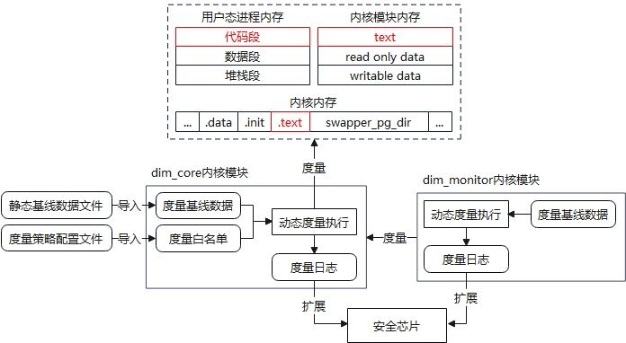

# DIM动态完整性度量用户指南

[TOC]

## 前言

本文档为DIM（Dynamic Integrity Measurement）动态完整性度量特性的基本介绍以及使用说明。

## 1 背景

随着信息产业的不断发展，信息系统所面临的安全风险也日益增长。信息系统中可能运行大量软件，部分软件不可避免地存在漏洞，这些漏洞一旦被攻击者利用，可能会对系统业务造成严重的影响，如数据泄露、服务不可用等。

绝大部分的软件攻击，都会伴随着完整性破坏，如恶意进程运行、配置文件篡改、后门植入等。因此业界提出了完整性保护技术，指的是从系统启动开始，对关键数据进行度量和校验，从而保证系统运行可预期。当前业界已广泛使用的完整性保护技术（如安全启动、文件完整性度量等）都无法对进程运行时的内存数据进行保护。如果攻击者利用一些手段修改了进程的代码指令，可能导致进程被劫持或被植入后门，具有攻击性强，隐蔽性高的特点。对于这种攻击手段，业界提出了动态完整性度量技术，即对进程的运行时内存中的关键数据进行度量和保护。

## 2 术语名词

静态基线：针对度量目标对应的二进制文件进行解析生成的度量基准数据；

动态基线：针对度量目标执行首次度量的度量结果；

度量策略：指定度量目标的配置信息；

度量日志：存储度量结果的列表，包含度量对象、度量结果等信息。

## 3 特性简介

DIM特性通过在程序运行时对内存中的关键数据（如代码段、数据段）进行度量，并将度量结果和基准值进行对比，确定内存数据是否被篡改，从而检测攻击行为，并采取应对措施。

### 1.1 功能范围

- 当前DIM特性支持在ARM64/X86架构系统中运行；
- 当前DIM特性支持对以下关键内存数据执行度量：
  - 用户态进程的代码段（对应ELF文件中属性为PT_LOAD、权限为RX的段，对应进程加载后权限为RX的vma区域）；
  - 内核模块代码段（起始地址为内核模块对应struct module结构体中的core_layout.base，长度为core_layout.text_size）；
  - 内核代码段（对应\_stext符号至\_etext），跳过可能由于内核static key机制发生变化的地址。
- 当前DIM特性支持对接以下硬件平台：
  - 支持将度量结果扩展至TPM 2.0芯片的PCR寄存器，以实现远程证明服务对接。

### 1.2 技术限制

- 对于用户态进程，仅支持度量文件映射代码段执行度量，不支持度量匿名代码段；
- 不支持度量内核热补丁；
- 仅支持主动触发机制，如果两次触发过程中发生了篡改-恢复的行为，会导致无法识别攻击；
- 对于主动修改代码段的场景（如代码段重定位、自修改或热补丁），会被识别为攻击；
- 对于内核、内核模块的度量，以触发动态基线时的度量结果作为度量基准值，静态基线值仅作为一个固定标识；
- 度量目标必须在触发动态基线的时刻就已在内存中加载（如进程运行或内核模块加载），否则后续无法度量；
- 在需要使用TPM芯片的PCR寄存器验证度量日志的场景下，DIM模块不允许卸载，否则会导致度量日志清空，而无法和PCR寄存器匹配；
- 特性启用后，会对系统性能存在一定影响，主要包括以下方面：
  - DIM特性自身加载以及基线数据、度量日志管理造成内存消耗，具体影响与保护策略配置相关；
  - DIM特性执行度量期间需要进行哈希运算，造成CPU消耗，具体影响与需要度量的数据大小有关；
  - DIM特性执行度量期间需要对部分资源执行上锁或获取信号量操作，可能导致其他并发进程等待。

### 1.3 规格约束

| 规格项                                                       | 值      |
| ------------------------------------------------------------ | ------- |
| 文件大小上限（策略文件、静态基线文件、签名文件、证书文件）   | 10MB    |
| 文件行数上限（策略文件、静态基线文件）                       | 10000行 |
| 同一个度量目标在一次动态基线后多次度量期间最多记录的篡改度量日志条数 | 10条    |

### 1.4 架构说明

DIM包含两个软件包dim_tools和dim，分别提供如下组件：

| 软件包    | 组件             | 说明                                                         |
| --------- | ---------------- | ------------------------------------------------------------ |
| dim_tools | dim_gen_baseline | 用户态组件，静态基线生成工具，通过解析ELF文件生成指定格式的代码段度量基线。 |
| dim       | dim_core         | 内核模块，执行核心的动态度量逻辑，包括策略解析、静态基线解析、动态基线建立、度量执行、度量日志记录、TPM芯片扩展操作等。 |
|           | dim_monitor      | 内核模块，执行对dim_core的代码段和关键数据的度量保护。       |

整体架构如下图所示：



- dim_gen_baseline组件用于生成动态度量所需要的基线数据，该基线数据在DIM特性运行时会被导入并作为度量基准值；
- dim_core组件实现对内存关键数据的度量功能；
- dim_monitor组件为dim_core组件提供保护，一定程度防止由于dim_core遭受攻击导致的DIM功能失效。

### 1.5 关键流程说明

dim_core和dim_monitor模块均提供了对内存数据的度量功能，包含两个核心流程：

- 动态基线流程：dim_core模块读取并解析策略和静态基线文件，然后对目标进程执行代码段度量，度量结果在内存中以动态基线形式存放，最后将动态基线数据和静态基线数据进行对比，并将对比结果记录度量日志；dim_monitor模块对dim_core模块的代码段和关键数据进行度量，作为动态基线并记录度量日志；
- 动态度量流程：dim_core和dim_monitor模块对目标执行度量，并将度量结果与动态基线值进行对比，如果对比不一致，则将结果记录度量日志。

### 1.3 接口说明

#### 1.3.1 文件路径说明

| 路径                            | 说明                                                         |
| ------------------------------- | ------------------------------------------------------------ |
| /etc/dim/policy                 | 度量策略文件                                                 |
| /etc/dim/policy.sig             | 度量策略签名文件，用于存放策略文件的签名信息，在签名校验功能开启的情况下使用 |
| /etc/dim/digest_list/*.hash     | 静态基线文件，用于存放度量的基准值信息                       |
| /etc/dim/digest_list/*.hash.sig | 静态基线签名文件，用于存放静态基线文件的签名信息，在签名校验功能开启的情况下使用 |
| /etc/keys/x509_dim.der          | 证书文件，用于校验策略文件和静态基线文件的签名信息，在签名校验功能开启的情况下使用 |
| /sys/kernel/security/dim        | DIM文件系统目录，DIM内核模块加载后生成，目录下提供对DIM功能进行操作的内核接口 |

#### 1.3.2 文件格式说明

##### 1.3.2.1 度量策略文件格式说明

文本文件，以UNIX换行符进行分隔，每行代表一条度量策略，当前支持以下几种配置格式：

1. 用户态进程代码段度量配置：

   ```
   measure obj=BPRM_TEXT path=<度量目标进程可执行文件或动态库对应二进制文件的绝对路径>
   ```

2. 内核模块代码段度量配置：

   ```
   measure obj=MODULE_TEXT path=<内核模块名>
   ```

3. 内核度量配置：

   ```
   measure obj=KERNEL_TEXT
   ```

**参考示例：**

```
# cat /etc/dim/policy
measure obj=BPRM_TEXT path=/usr/bin/bash
measure obj=BPRM_TEXT path=/usr/lib64/libc.so.6
measure obj=MODULE_TEXT name=ext4
measure obj=KERNEL_TEXT
```

##### 1.3.2.2 静态基线文件格式说明

文本文件，以UNIX换行符进行分隔，每行代表一条静态基线，当前支持以下几种配置格式：

1. 用户态进程基线：

   ```
   dim USER sha256:6ae347be2d1ba03bf71d33c888a5c1b95262597fbc8d00ae484040408a605d2b <度量目标进程可执行文件或动态库对应二进制文件的绝对路径>
   ```

2. 内核模块基线：

   ```
   dim KERNEL sha256:a18bb578ff0b6043ec5c2b9b4f1c5fa6a70d05f8310a663ba40bb6e898007ac5 <内核release号>/<内核模块名>
   ```

3. 内核基线：

   ```
   dim KERNEL sha256:2ce2bc5d65e112ba691c6ab46d622fac1b7dbe45b77106631120dcc5441a3b9a <内核release号>
   ```

**参考示例：**

```
dim USER sha256:6ae347be2d1ba03bf71d33c888a5c1b95262597fbc8d00ae484040408a605d2b /usr/bin/bash
dim USER sha256:bc937f83dee4018f56cc823f5dafd0dfedc7b9872aa4568dc6fbe404594dc4d0 /usr/lib64/libc.so.6
dim KERNEL sha256:a18bb578ff0b6043ec5c2b9b4f1c5fa6a70d05f8310a663ba40bb6e898007ac5 6.4.0-1.0.1.4.oe2309.x86_64/dim_monitor
dim KERNEL sha256:2ce2bc5d65e112ba691c6ab46d622fac1b7dbe45b77106631120dcc5441a3b9a 6.4.0-1.0.1.4.oe2309.x86_64
```

##### 1.3.2.3 度量日志格式说明

文本内容，以UNIX换行符进行分隔，每行代表一条度量日志，格式为：

```
<PCR寄存器编号> <度量日志哈希值> <度量算法>:<度量哈希值> <度量对象> <度量日志类型>
```

**参考示例：**

1. 对bash进程代码段执行度量，度量结果与静态基线一致：

   ```
   12 0f384a6d24e121daf06532f808df624d5ffc061e20166976e89a7bb24158eb87 sha256:db032449f9e20ba37e0ec4a506d664f24f496bce95f2ed972419397951a3792e /usr/bin.bash [static baseline]
   ```

2. 对bash进程代码段执行度量，度量结果与静态基线不一致：

   ```
   12 0f384a6d24e121daf06532f808df624d5ffc061e20166976e89a7bb24158eb87 sha256:db032449f9e20ba37e0ec4a506d664f24f496bce95f2ed972419397951a3792e /usr/bin.bash [tampered]
   ```

3. 对ext4内核模块代码段执行度量，未找到静态基线：

   ```
   12 0f384a6d24e121daf06532f808df624d5ffc061e20166976e89a7bb24158eb87 sha256:db032449f9e20ba37e0ec4a506d664f24f496bce95f2ed972419397951a3792e ext4 [no static baseline]
   ```

4. dim_monitor对dim_core执行度量，记录基线时的度量结果：

   ```
   12 660d594ba050c3ec9a7cdc8cf226c5213c1e6eec50ba3ff51ff76e4273b3335a sha256:bdab94a05cc9f3ad36d29ebbd14aba8f6fd87c22ae580670d18154b684de366c dim_core.text [dynamic baseline]
   12 28a3cefc364c46caffca71e7c88d42cf3735516dec32796e4883edcf1241a7ea sha256:0dfd9656d6ecdadc8ec054a66e9ff0c746d946d67d932cd1cdb69780ccad6fb2 dim_core.data [dynamic baseline]
   ```

##### 1.3.2.1 证书/签名文件

为通用格式，详见**3.7 开启签名校验**章节。

#### 1.3.3 内核模块参数说明

##### 1.3.3.1 dim_core模块参数

| 参数名               | 参数内容                                                     | 范围                     | 默认值 |
| -------------------- | ------------------------------------------------------------ | ------------------------ | ------ |
| measure_log_capacity | 度量日志最大条数，当dim_core记录的度量日志数量达到参数设置时，停止记录度量日志 | 100-UINT_MAX（64位系统） | 100000 |
| measure_schedule     | 度量完一个进程/模块后调度的时间，单位毫秒，设置为0代表不调度 | 0-1000                   | 0      |
| measure_interval     | 自动度量周期，单位分钟，设置为0代表不设置自动度量            | 0-525600                 | 0      |
| measure_hash         | 度量哈希算法                                                 | sha256, sm3              | sha256 |
| measure_pcr          | 将度量结果扩展至TPM芯片的PCR寄存器，设置为0代表不扩展（注意需要与芯片实际的PCR编号保持一致） | 0-128                    | 0      |
| signature            | 是否启用策略文件和签名机制，设置为0不启用，设置为1代表启用   | 0, 1                     | 0      |

**使用示例**：

```
insmod /path/to/dim_core.ko measure_log_capacity=10000 measure_schedule=10 measure_pcr=12
modprobe dim_core measure_log_capacity=10000 measure_schedule=10 measure_pcr=12
```

##### 1.3.3.2 dim_monitor模块参数

| 参数名               | 参数内容                                                     | 范围                     | 默认值 |
| -------------------- | ------------------------------------------------------------ | ------------------------ | ------ |
| measure_log_capacity | 度量日志最大条数，当dim_monitor记录的度量日志数量达到参数设置时，停止记录度量日志 | 100-UINT_MAX（64位系统） | 100000 |
| measure_hash         | 度量哈希算法                                                 | sha256, sm3              | sha256 |
| measure_pcr          | 将度量结果扩展至TPM芯片的PCR寄存器，设置为0代表不扩展        | 0-128                    | 0      |

**使用示例**：

```
insmod /path/to/dim_monitor.ko measure_log_capacity=10000 measure_hash=sm3
modprobe dim_monitor measure_log_capacity=10000 measure_hash=sm3
```

#### 1.3.4 内核接口说明

##### 1.3.4.1 dim_core模块接口

| 接口名                     | 属性 | 功能                                                         | 示例                                                      |
| -------------------------- | ---- | ------------------------------------------------------------ | --------------------------------------------------------- |
| measure                    | 只写 | 写入字符串1触发动态度量，成功返回0，失败返回错误码           | echo 1 >  /sys/kernel/security/dim/measure                |
| baseline_init              | 只写 | 写入字符串1触发动态基线，成功返回0，失败返回错误码           | echo 1 >  /sys/kernel/security/dim/baseline_init          |
| ascii_runtime_measurements | 只读 | 读取接口查询度量日志                                         | cat  /sys/kernel/security/dim/ ascii_runtime_measurements |
| runtime_status             | 读写 | 读取接口返回状态类型信息，失败返回错误码                     | cat  /sys/kernel/security/dim/runtime_status              |
| interval                   | 读写 | 写入数字字符串设置自动度量周期（范围同measure_interval参数），读取接口查询当前自动度量周期。失败返回错误码 | echo 10 >  /sys/kernel/security/dim/interval              |

**dim_core状态类型信息说明：**

状态信息以“Dim running status: ”为前缀，冒号后字段取值：

- DIM_NO_BASELINE：表示dim_core已加载，但未进行任何操作；
- DIM_BASELINE_RUNNING：表示正在进行动态基线建立；
- DIM_MEASURE_RUNNING：表示正在进行动态度量度量；
- DIM_PROTECTED：表示已完成动态基线建立，处于受保护状态；
- DIM_ERROR：执行动态基线建立或动态度量时发生错误，需要用户解决错误后重新触发动态基线建立或动态度量。

##### 1.3.4.2 dim_core模块接口

| 接口名                             | 属性 | 说明                                           | 示例                                                         |
| ---------------------------------- | ---- | ---------------------------------------------- | ------------------------------------------------------------ |
| monitor_run                        | 只写 | 写入字符串1触发度量，成功返回0，失败返回错误码 | echo 1 >  /sys/kernel/security/dim/monitor_run               |
| dim_monitor_baseline               | 只写 | 写入字符串1触发基线，成功返回0，失败返回错误码 | echo 1 >  /sys/kernel/security/dim/dim_monitor_baseline      |
| monitor_ascii_runtime_measurements | 只读 | 读取接口查询度量日志                           | cat  /sys/kernel/security/dim/ monitor_ascii_runtime_measurements |
| monitor_status                     | 只读 | 读取接口返回状态类型信息，失败返回错误码       | cat  /sys/kernel/security/dim/monitor_status                 |

**dim_monitor状态类型信息说明：**

- ready：表示dim_monitior已加载，但未进行任何操作；
- running：表示正在进行动态基线建立或动态度量；
- error：执行动态基线建立或动态度量时发生错误，需要用户解决错误后重新触发动态基线建立或动态度量；
- protected：表示已完成动态基线建立，处于受保护状态。

#### 1.3.5 用户态工具接口说明

##### 1.3.5.1 dim_gen_baseline命令行接口

   详见：https://gitee.com/HuaxinLuGitee/dim_tools/blob/master/doc/cmd.md

## 3 如何使用

### 3.1 安装/卸载

**前置条件**：

- OS版本支持：openEuler 23.09以上版本；
- 内核版本支持：当前支持openEuler kernel 5.10/6.4版本。

**步骤1**：安装dim_tools和dim软件包，以openEuler 23.09版本为例：

```
# yum install -y dim_tools dim
```

软件包安装完成后，DIM内核组件不会默认加载，可通过如下命令进行加载和卸载：

```
# modprobe dim_core 或 insmod /path/to/dim_core.ko
# modprobe dim_monitor 或 insmod /path/to/dim_monitor.ko
# rmmod dim_monitor
# rmmod dim_core
```

加载成功后，可以通过如下命令查询：

```
# lsmod | grep dim_core
dim_core               77824  1 dim_monitor
# lsmod | grep dim_monitor
dim_monitor            36864  0
```

**注意：**

- dim_monitor必须后于dim_core加载，先于dim_core卸载；
- 也可使用源码编译安装，详见https://gitee.com/openeuler/dim/README。

### 3.2 度量用户态进程代码段

**前置条件**：

- dim_core模块加载成功；

- 用户需要准备一个常驻的度量目标用户态程序，本小节假设程序路径为/opt/dim/demo/dim_test_demo：

   ```
   # /opt/dim/demo/dim_test_demo &
   ```

**步骤1**：为度量目标进程对应的二进制文件生成静态基线：

```
# mkdir -p /etc/dim/digest_list
# dim_gen_baseline /opt/dim/demo/dim_test_demo -o /etc/dim/digest_list/test.hash
```

**步骤2**：配置度量策略：

```
# echo "measure obj=BPRM_TEXT path=/opt/dim/demo/dim_test_demo" > /etc/dim/policy
```

**步骤3**：触发动态基线建立：

```
# echo 1 > /sys/kernel/security/dim/baseline_init
```

**步骤4**：查询度量日志：

```
# cat /sys/kernel/security/dim/ascii_runtime_measurements 
0 e9a79e25f091e03a8b3972b1a0e4ae2ccaed1f5652857fe3b4dc947801a6913e sha256:02e28dff9997e1d81fb806ee5b784fd853eac8812059c4dba7c119c5e5076989 /opt/dim/demo/dim_test_demo [static baseline]
```

如上度量日志说明目标进程被成功度量，且度量结果与静态基线一致。

**步骤5**：触发动态度量：

```
# echo 1 > /sys/kernel/security/dim/measure
```

度量完成后可通过**步骤4**查询度量日志，如果度量结果和动态基线阶段的度量结果一致，则度量日志不会更新，否则会新增异常度量日志。尝试篡改目标程序（如采用修改代码重新编译的方式，过程略）并重新启动目标程序：

```
# pkill dim_test_demo
# /opt/dim/demo/dim_test_demo &
```

再次触发度量并查询度量日志，可以发现有标识为“tampered”的度量日志：

```
# cat /sys/kernel/security/dim/ascii_runtime_measurements 
0 e9a79e25f091e03a8b3972b1a0e4ae2ccaed1f5652857fe3b4dc947801a6913e sha256:02e28dff9997e1d81fb806ee5b784fd853eac8812059c4dba7c119c5e5076989 /opt/dim/demo/dim_test_demo [static baseline]
0 08a2f6f2922ad3d1cf376ae05cf0cc507c2f5a1c605adf445506bc84826531d6 sha256:855ec9a890ff22034f7e13b78c2089e28e8d217491665b39203b50ab47b111c8 /opt/dim/demo/dim_test_demo [tampered]
```

### 3.3 度量内核模块代码段

**前置条件**：

- dim_core模块加载成功；

- 用户需要准备一个度量目标内核模块，本小节假设内核模块路径为/opt/dim/demo/dim_test_demo.ko，模块名为dim_test_demo：

  ```
  # insmod /opt/dim/demo/dim_test_demo.ko
  ```

**注意**：需要保证内核模块的内核编译环境版本号和当前系统内核版本号一致，可以使用如下方法确认：

```
# modinfo dim_monitor.ko  | grep vermagic | grep "$(uname -r)"
vermagic:       6.4.0-1.0.1.4.oe2309.x86_64 SMP preempt mod_unload modversions
```

即内核模块vermagic信息的第一个字段需要和当前内核版本号完全一致。

**步骤1**：为度量目标内核模块生成静态基线：

```
# mkdir -p /etc/dim/digest_list
# dim_gen_baseline /opt/dim/demo/dim_test_module.ko -o /etc/dim/digest_list/test.hash
```

**步骤2**：配置度量策略：

```
# echo "measure obj=MODULE_TEXT name=dim_test_module" > /etc/dim/policy
```

**步骤3**：触发动态基线建立：

```
# echo 1 > /sys/kernel/security/dim/baseline_init
```

**步骤4**：查询度量日志：

```
# cat /sys/kernel/security/dim/ascii_runtime_measurements 
0 9603a9d5f87851c8eb7d2619f7abbe28cb8a91f9c83f5ea59f036794e23d1558 sha256:9da4bccc7ae1b709deab8f583b244822d52f3552c93f70534932ae21fac931c6 dim_test_module [static baseline]
```

如上度量日志说明dim_test_module模块被成功度量，并以当前的度量结果作为后续度量的基准值（此时度量日志中的哈希值不代表实际度量值）。

**步骤5**：触发动态度量：

```
echo 1 > /sys/kernel/security/dim/measure
```

度量完成后可通过**步骤4**查询度量日志，如果度量结果和动态基线阶段的度量结果一致，则度量日志不会更新，否则会新增异常度量日志。尝试篡改目标内核模块 （如采用修改代码重新编译的方式，过程略）并重新加载：

```
rmmod dim_test_module
insmod /opt/dim/demo/dim_test_module.ko
```

再次触发度量并查询度量日志，可以发现有标识为“tampered”的度量日志：

```
# cat /sys/kernel/security/dim/ascii_runtime_measurements 
0 9603a9d5f87851c8eb7d2619f7abbe28cb8a91f9c83f5ea59f036794e23d1558 sha256:9da4bccc7ae1b709deab8f583b244822d52f3552c93f70534932ae21fac931c6 dim_test_module [static baseline]
0 6205915fe63a7042788c919d4f0ff04cc5170647d7053a1fe67f6c0943cd1f40 sha256:4cb77370787323140cb572a789703be1a4168359716a01bf745aa05de68a14e3 dim_monitor [tampered]
```

### 3.4 度量内核代码段

**前置条件**：

- dim_core模块加载成功。

**步骤1**：为内核生成静态基线：

```
# mkdir -p /etc/dim/digest_list
# dim_gen_baseline -k "$(uname -r)" -o /etc/dim/digest_list/test.hash /boot/vmlinuz-6.4.0-1.0.1.4.oe2309.x86_64
```

**注意：**/boot/vmlinuz-6.4.0-1.0.1.4.oe2309.x86_64文件名不固定。

**步骤2**：配置DIM策略：

```
# echo "measure obj=KERNEL_TEXT" > /etc/dim/policy
```

**步骤3**：触发动态基线建立：

```
# echo 1 > /sys/kernel/security/dim/baseline_init
```

**步骤4**：查询度量日志：

```
# cat /sys/kernel/security/dim/ascii_runtime_measurements 
0 ef82c39d767dece1f5c52b31d1e8c7d55541bae68a97542dda61b0c0c01af4d2 sha256:5f1586e95b102cd9b9f7df3585fe13a1306cbd464f2ebe47a51ad34128f5d0af 6.4.0-1.0.1.4.oe2309.x86_64 [static baseline]
```

如上度量日志说明内核被成功度量，并以当前的基线结果作为后续度量的基准值（此时度量日志中的哈希值不代表实际度量值）。

**步骤5**：触发动态度量：

```
# echo 1 > /sys/kernel/security/dim/measure
```

度量完成后可通过**步骤4**查询度量日志，如果度量结果和动态基线阶段的度量结果一致，则度量日志不会更新，否则会新增异常度量日志。

### 3.5 度量dim_core模块

**前置条件**：

- dim_core和dim_monitor模块加载成功；
- 度量策略配置完成。

**步骤1**：触发dim_core动态基线：

```
# echo 1 > /sys/kernel/security/dim/baseline_init
```

**步骤2**：触发dim_monitor动态基线：

```
# echo 1 > /sys/kernel/security/dim/monitor_baseline
```

**步骤3**：查询dim_monitor度量日志：

```
# cat /sys/kernel/security/dim/ascii_runtime_measurements 
0 c1b0d9909ddb00633fc6bbe7e457b46b57e165166b8422e81014bdd3e6862899 sha256:35494ed41109ebc9bf9bf7b1c190b7e890e2f7ce62ca1920397cd2c02a057796 dim_core.text [dynamic baseline]
0 9be7121cd2c215d454db2a8aead36b03d2ed94fad0fbaacfbca83d57a410674f sha256:f35d20aae19ada5e633d2fde6e93133c3b6ae9f494ef354ebe5b162398e4d7fa dim_core.data [dynamic baseline]
```

如上度量日志说明dim_core模块被成功度量，并以当前的基线结果作为后续度量的基准值。

**步骤4**：触发dim_monitor动态度量：

```
# echo 1 > /sys/kernel/security/dim/monitor_run
```

度量完成后可通过**步骤4**查询度量日志，如果度量结果和动态基线阶段的度量结果一致，则度量日志不会更新，否则会新增异常度量日志。尝试修改策略后重新执触发dim_core动态基线，此时由于度量目标发生变化，dim_core管理的基线数据也会发生变更，从而dim_monitor的度量结果也会发生变化：

```
# echo "measure obj=BPRM_TEXT path=/usr/bin/bash" > /etc/dim/policy
# echo 1 > /sys/kernel/security/dim/baseline_init
```

再次触发dim_monitor度量并查询度量日志，可以发现有标识为“tampered”的度量日志：

```
# echo 1 > /sys/kernel/security/dim/monitor_baseline
# cat /sys/kernel/security/dim/monitor_ascii_runtime_measurements
0 c1b0d9909ddb00633fc6bbe7e457b46b57e165166b8422e81014bdd3e6862899 sha256:35494ed41109ebc9bf9bf7b1c190b7e890e2f7ce62ca1920397cd2c02a057796 dim_core.text [dynamic baseline]
0 9be7121cd2c215d454db2a8aead36b03d2ed94fad0fbaacfbca83d57a410674f sha256:f35d20aae19ada5e633d2fde6e93133c3b6ae9f494ef354ebe5b162398e4d7fa dim_core.data [dynamic baseline]
0 6a60d78230954aba2e6ea6a6b20a7b803d7adb405acbb49b297c003366cfec0d sha256:449ba11b0bfc6146d4479edea2b691aa37c0c025a733e167fd97e77bbb4b9dab dim_core.data [tampered]
```

### 3.6 扩展TPM PCR寄存器

**前置条件**：

- 系统已安装TPM 2.0芯片，执行如下命令返回不为空：

  ```
  # ls /dev/tpm*
  /dev/tpm0  /dev/tpmrm0
  ```

- 系统已安装tpm2-tools软件包，执行如下命令返回不为空：

  ```
  # rpm -qa tpm2-tools
  ```

- 度量策略和静态基线配置完成。

**步骤1**：加载dim_core和dim_monitor模块，并配置扩展度量结果的PCR寄存器编号，这里为dim_core度量结果指定PCR 12，为dim_monitor指定PCR 13：

```
# modprobe dim_core measure_pcr=12
# modprobe dim_monitor measure_pcr=13
```

**步骤2**：触发dim_core和dim_monitor基线：

```
# echo 1 > /sys/kernel/security/dim/baseline_init
# echo 1 > /sys/kernel/security/dim/monitor_baseline
```

**步骤3**：查看度量日志，每条日志都显示了对应的TPM PCR寄存器编号：

```
# cat /sys/kernel/security/dim/ascii_runtime_measurements
12 2649c414d1f9fcac1c8d0df8ae7b1c18b5ea10a162b957839bdb8f8415ec6146 sha256:83110ce600e744982d3676202576d8b94cea016a088f99617767ddbd66da1164 /usr/lib/systemd/systemd [static baseline]
# cat /sys/kernel/security/dim/monitor_ascii_runtime_measurements
13 72ee3061d5a80eb8547cd80c73a80c3a8dc3b3e9f7e5baa10f709350b3058063 sha256:5562ed25fcdf557efe8077e231399bcfbcf0160d726201ac8edf7a2ca7c55ad0 dim_core.text [dynamic baseline]
13 8ba44d557a9855c03bc243a8ba2d553347a52c1a322ea9cf8d3d1e0c8f0e2656 sha256:5279eadc235d80bf66ba652b5d0a2c7afd253ebaf1d03e6e24b87b7f7e94fa02 dim_core.data [dynamic baseline]
```

**步骤4**：检查TPM芯片的PCR寄存器，对应的寄存器均已被写入了扩展值：

```
# tpm2_pcrread sha256 | grep "12:"
  12: 0xF358AC6F815BB29D53356DA2B4578B4EE26EB9274E553689094208E444D5D9A2
# tpm2_pcrread sha256 | grep "13:"
  13: 0xBFB9FF69493DEF9C50E52E38B332BDA8DE9C53E90FB96D14CD299E756205F8EA
```

### 3.7 开启签名校验

**前置条件**：

- 用户准备公钥证书和签名私钥，签名算法需要为RSA，哈希算法为sha256，证书格式需要为DER。也可以采用如下方式生成：

  ```
  # openssl genrsa -out dim.key 4096
  # openssl req -new -sha256 -key dim.key -out dim.csr -subj "/C=AA/ST=BB/O=CC/OU=DD/CN=DIM Test" 
  # openssl x509 -req -days 3650 -signkey dim.key -in dim.csr -out dim.crt
  # openssl x509 -in dim.crt -out dim.der -outform DER
  ```

- 度量策略配置完成。

**步骤1**：将DER格式的证书放置在/etc/keys/x509_dim.der路径：

```
# mkdir -p /etc/keys
# cp dim.der /etc/keys/x509_dim.der
```

**步骤2**：对策略文件和静态基线文件进行签名，签名文件必须为原文件名直接添加.sig后缀：

```
# openssl dgst -sha256 -out /etc/dim/policy.sig -sign dim.key /etc/dim/policy
# openssl dgst -sha256 -out /etc/dim/digest_list/test.hash.sig -sign dim.key /etc/dim/digest_list/test.hash
```

**步骤3**：加载dim_core模块，开启签名校验功能：

```
modprobe dim_core signature=1
```

此时，策略文件和静态基线文件均需要通过签名校验后才能加载，修改策略文件触发基线，会导致基线失败：

```
# echo "" >> /etc/dim/policy
# echo 1 > /sys/kernel/security/dim/baseline_init
-bash: echo: write error: Key was rejected by service
```

**注意**：如果某个静态基线文件签名校验失败，dim_core会跳过该文件的解析，而不会导致基线失败。

### 3.8 配置度量算法

**前置条件**：

- 度量策略配置完成。

**步骤1**：加载dim_core和dim_monitor模块，并配置度量算法，这里以sm3算法为例：

```
# modprobe dim_core measure_hash=sm3
# modprobe dim_monitor measure_hash=sm3
```

**步骤2**：配置策略并为度量目标程序生成sm3算法的静态基线：

```
# echo "measure obj=BPRM_TEXT path=/opt/dim/demo/dim_test_demo" > /etc/dim/policy
# dim_gen_baseline -a sm3 /opt/dim/demo/dim_test_demo -o /etc/dim/digest_list/test.hash
```

**步骤3**：触发基线：

```
# echo 1 > /sys/kernel/security/dim/baseline_init
# echo 1 > /sys/kernel/security/dim/monitor_baseline
```

**步骤4**：查看度量日志，每条日志都显示了对应的摘要算法：

```
# cat /sys/kernel/security/dim/ascii_runtime_measurements
0 585a64feea8dd1ec415d4e67c33633b97abb9f88e6732c8a039064351d24eed6 sm3:ca84504c02bef360ec77f3280552c006ce387ebb09b49b316d1a0b7f43039142 /opt/dim/demo/dim_test_demo [static baseline]
# cat /sys/kernel/security/dim/monitor_ascii_runtime_measurements 
0 e6a40553499d4cbf0501f32cabcad8d872416ca12855a389215b2509af76e60b sm3:47a1dae98182e9d7fa489671f20c3542e0e154d3ce941440cdd4a1e4eee8f39f dim_core.text [dynamic baseline]
0 2c862bb477b342e9ac7d4dd03b6e6705c19e0835efc15da38aafba110b41b3d1 sm3:a4d31d5f4d5f08458717b520941c2aefa0b72dc8640a33ee30c26a9dab74eae9 dim_core.data [dynamic baseline]
```

### 3.9 配置自动周期度量

**前置条件**：

- 度量策略配置完成；

**方式1**：加载dim_core模块，配置定时度量间隔，此处配置为1分钟：

```
modprobe dim_core measure_interval=1
```

在模块加载完成后，自动触发动态基线流程，后续每隔1分钟触发一次动态度量。

**注意**：此时不能配置dim_core度量自身代码段的度量策略，否则会产生误报。

**方式2**：加载dim_core模块后，也可通过内核模块接口配置定时度量间隔，此处配置为1分钟：

```
modprobe dim_core
echo 1 > /sys/kernel/security/dim/interval
```

此时不会立刻触发度量，1分钟后会触发动态基线或动态度量，后续每隔1分钟触发一次动态度量。

### 3.10 配置度量调度时间

**前置条件**：

- 度量策略配置完成；

**步骤1**：加载dim_core模块，配置定时度量调度时间，此处配置为10毫秒：

```
modprobe dim_core measure_schedule=10
```

触发动态基线或动态度量时，dim_core每度量一个进程，就会调度让出CPU 10毫秒时间。

## 4 LICENSE

本文档使用的协议为[BY-SA 4.0](LICENSE)。
